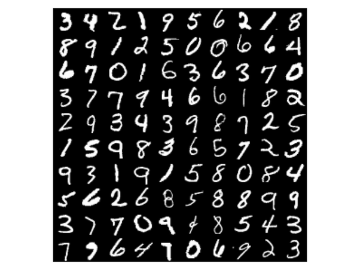

# CNN Classifier for MNIST Handwritten Digits

A convolutional neural network that classifies handwritten digits, built with TensorFlow 2 / Keras.


## Overview

This project goes through the complete workflow of a small image classification project: load and
preprocess the data, build a convolutional network, train it, read the learning curves, evaluate it
on unseen data and inspect individual predictions one by one.

The model reaches **98.36% accuracy on the 10,000 test images** with a network of only 105,306
parameters and a single convolutional layer, trained for 5 epochs in around 13 seconds on CPU.

Everything lives in a single notebook: [`mnist_cnn_classifier.ipynb`](mnist_cnn_classifier.ipynb)

## Dataset



The [MNIST dataset](http://yann.lecun.com/exdb/mnist/), loaded directly from `tf.keras.datasets`:

|  |  |
|---|---|
| Training set | 60,000 images |
| Test set | 10,000 images |
| Image format | 28x28 grayscale, pixel values 0-255 |
| Classes | the digits 0 to 9 |
| Task | multi-class image classification |

Preprocessing is minimal: pixel values are scaled to the `[0, 1]` range and a channel dimension is
added, so each image becomes a `(28, 28, 1)` tensor that `Conv2D` can read.

## Model

A small `Sequential` network with 105,306 trainable parameters:

| Layer | Configuration | Output shape | Params |
|-------|---------------|--------------|--------|
| `Conv2D` | 8 filters 3x3, `padding="SAME"`, ReLU | (28, 28, 8) | 80 |
| `MaxPooling2D` | 2x2 | (14, 14, 8) | 0 |
| `Flatten` | - | (1568,) | 0 |
| `Dense` | 64 units, ReLU | (64,) | 100,416 |
| `Dense` | 64 units, ReLU | (64,) | 4,160 |
| `Dense` | 10 units, softmax | (10,) | 650 |

Trained for 5 epochs with the Adam optimizer and `sparse_categorical_crossentropy` as the loss
function, the version of cross entropy used when the labels are integers instead of one-hot vectors.

## Workflow

1. **Load and preprocess** — scaling to `[0, 1]` and adding the channel dimension.
2. **Build the model** — one convolutional block plus a small dense classifier.
3. **Compile** — Adam, sparse categorical cross entropy, accuracy as the metric.
4. **Train** — 5 epochs over the 60,000 training images, 1875 steps per epoch.
5. **Learning curves** — accuracy and loss per epoch, plotted from the training history.
6. **Evaluate** — loss and accuracy on the 10,000 test images.
7. **Predictions** — four random test digits shown next to the probability distribution the model
   assigns to each class.

## Results

| Metric | Training (epoch 5) | Test |
|--------|--------------------|------|
| Accuracy | 99.09% | **98.36%** |
| Loss | 0.0286 | **0.0544** |

Training was stable, with no oscillations and without the curves flattening out too early:

| Epoch | Accuracy | Loss |
|-------|----------|------|
| 1 | 93.28% | 0.2219 |
| 2 | 97.65% | 0.0761 |
| 3 | 98.36% | 0.0508 |
| 4 | 98.81% | 0.0376 |
| 5 | 99.09% | 0.0286 |

## Key takeaways

- **A single convolutional layer is enough for MNIST.** 8 filters of 3x3 plus a small dense
  classifier get past 98% on unseen data; the dataset does not need a deep architecture.
- **The convolution is cheap, the flattening is not.** Of the 105,306 parameters, only 80 belong to
  the convolutional layer and 100,416 to the first dense layer, which receives the 1568 values
  produced by `Flatten`. Almost all of the cost of this architecture comes from that transition.
- **Mild overfitting, as expected.** 99.09% on training against 98.36% on test is a gap of 0.73
  points, that is 164 errors out of 10,000 images never seen before.
- **The model is not only right, it is confident.** In the random samples of the last section the
  softmax distributions are concentrated almost entirely on a single class.

## Project structure

```
.
├── data/                        # Images used in the notebook
├── src/tf2_cnn_mnist_classifier/  # Package scaffold
├── mnist_cnn_classifier.ipynb   # Main notebook
├── pyproject.toml               # Dependencies (uv project)
└── uv.lock                      # Pinned versions
```

## Getting started

The project is managed with [uv](https://docs.astral.sh/uv/) and requires Python 3.11+.

```bash
# Clone the repository
git clone https://github.com/ramirezgrosas/tf2-cnn-mnist-classifier.git
cd tf2-cnn-mnist-classifier

# Create the virtual environment and install the dependencies
uv sync
```

Then open the notebook in VS Code and select `.venv` as the kernel, or launch Jupyter directly:

```bash
uv run --with jupyter jupyter lab
```

The dataset is downloaded automatically by Keras the first time the notebook runs, so there is
nothing else to set up.

Main dependencies: TensorFlow 2.21 (Keras 3.15), NumPy, pandas and matplotlib.

## Possible improvements

- Use a validation split during training to monitor generalisation epoch by epoch instead of only
  at the end.
- Add more convolutional blocks with more filters, the usual way to push MNIST above 99%.
- Add regularisation (dropout or batch normalisation) if the gap between training and test grows
  when training for longer.
- Build a confusion matrix to find out which digits get confused with each other.

## Author

**Diego Ramírez Rosas** — [ramirezgrosas](https://github.com/ramirezgrosas)
